# VidNova

VidNova is a modern, YouTube-like video streaming application that utilizes the YouTube API to provide users with an engaging platform for exploring, watching, and interacting with video content. Featuring dynamic video suggestions, live chat, and a sleek design, VidNova redefines how you experience video streaming.

---

## 🚀 Features

### 🎥 Video Browsing

- **Dynamic Video Suggestions**: Displays a grid of videos fetched using the YouTube API.
- **Responsive Layout**: Adapts the grid layout based on screen size and menu visibility.
- **Interactive Button List**: Navigate categories with ease.

### ▶️ Video Playback

- **Watch Page**: Plays selected videos in an embedded YouTube player.
- **Live Status Detection**: Identifies and handles live videos with a "Live Chat" section.
- **Comments Section**: Displays a list of comments for enhanced user engagement.

### 🗨️ Live Interaction

- **Real-Time Live Chat**: Engage with viewers during live streams.
- **Conditional Rendering**: Automatically displays live chat or video suggestions based on video type.

### 🔍 Search Functionality

- **Search Results**: Displays filtered video results using YouTube API.
- **State Management**: Utilizes Redux for seamless state handling.

### 🎨 Modern UI Design

- **Fully Responsive**: Tailored for all devices using Tailwind CSS.
- **Intuitive Interface**: Inspired by YouTube’s design with cool aesthetics.
- **User-Friendly Navigation**: Simplifies video discovery and playback.

---

## 🛠️ Tech Stack

### Frontend

- **React**: For building dynamic and reusable components.
- **React Router**: Enables navigation and dynamic routing.
- **Redux Toolkit**: Simplifies state management.
- **Tailwind CSS**: Ensures a sleek, responsive design.

### API Integration

- **YouTube Data API**: Fetches video data, including live status, titles, and thumbnails.

---

## 📖 Usage

- **Browse Videos**: Discover trending videos on the homepage.
- **Search Videos**: Use the search bar to find videos by keyword.
- **Watch Videos**: Play selected videos on the `WatchPage`.
- **Interact with Live Streams**: Engage with real-time live chat or explore suggested videos.

---

## 🗂️ Folder Structure

```plaintext
src/
├── components/
│   ├── ButtonList.js
│   ├── CommentsList.js
│   ├── LiveChat.js
│   ├── VideoCard.js
│   ├── VideoContainer.js
│   ├── VideoSuggestions.js
│   ├── WatchPage.js
├── utils/
│   ├── appSlice.js
│   ├── commentsData.js
│   ├── constant.js
│   ├── searchSlice.js
├── styles/
│   └── TailwindCSS configuration
├── App.js
├── index.js
```

---

## 🌟 Key Features in Development

- **Nested Comments**: Recursively display comments, similar to Reddit.

---

## 🙏 Acknowledgments

- Inspired by YouTube’s design and functionality.
- Special thanks to the YouTube Data API for its powerful tools.

---

## 📸 Screenshots

### 💻 Laptop View

### 🎥 Home Page - Video Grid

Displays trending and recommended videos in a dynamic grid format.

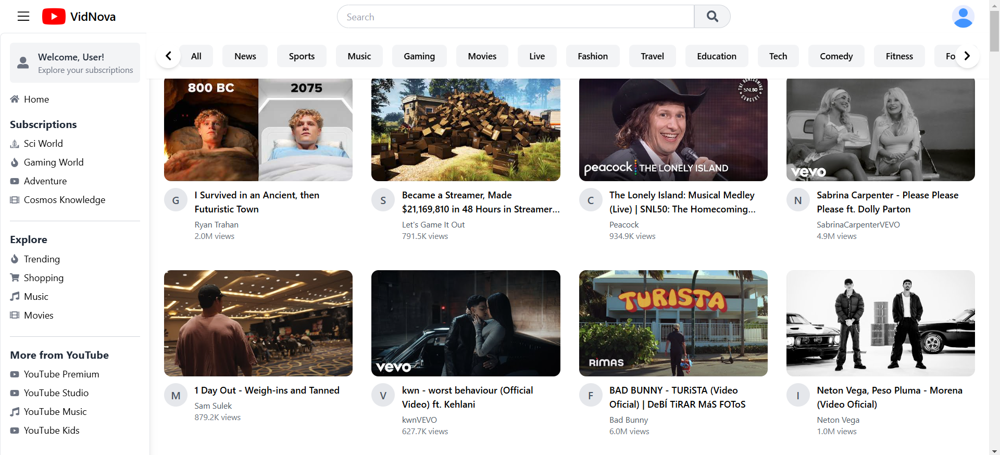
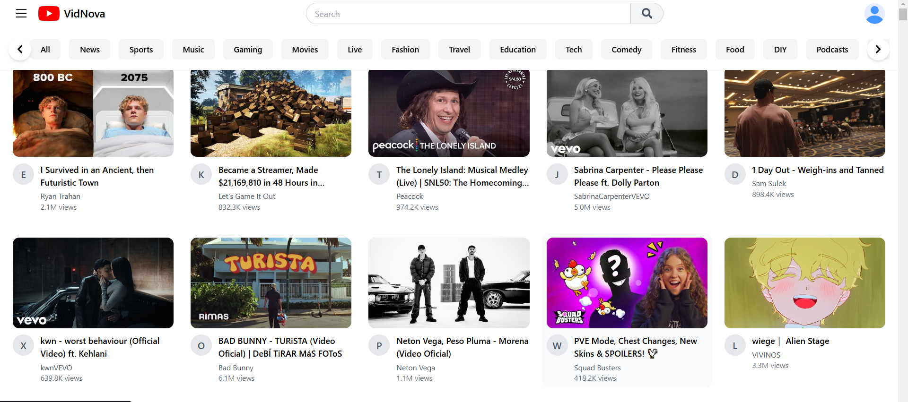

### ▶️ Video Playback - Watch Page

Embedded YouTube player with related videos.

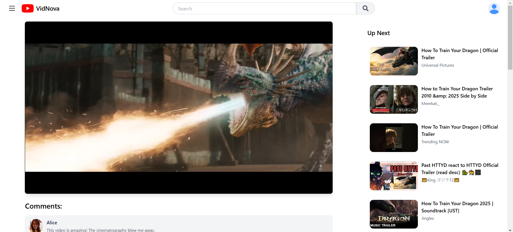
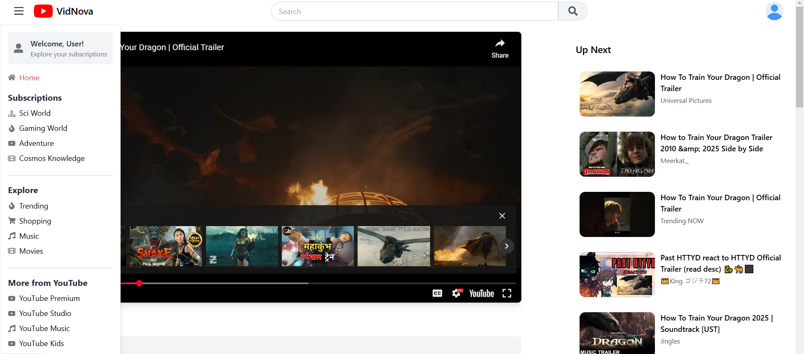

### 💬 Nested Comments Section

Displays a hierarchical structure of comments (Reddit-style).

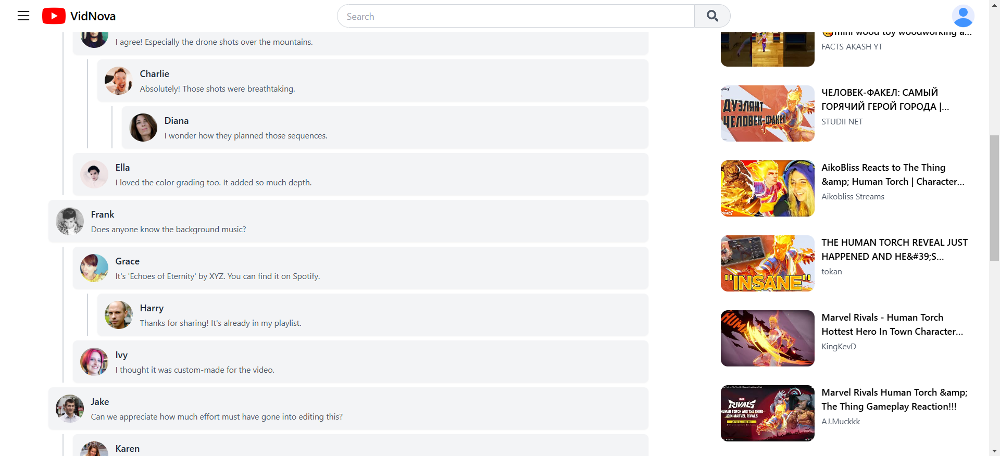

### 🔍 Search Suggestions

Displays real-time search suggestions as the user types in the search bar.

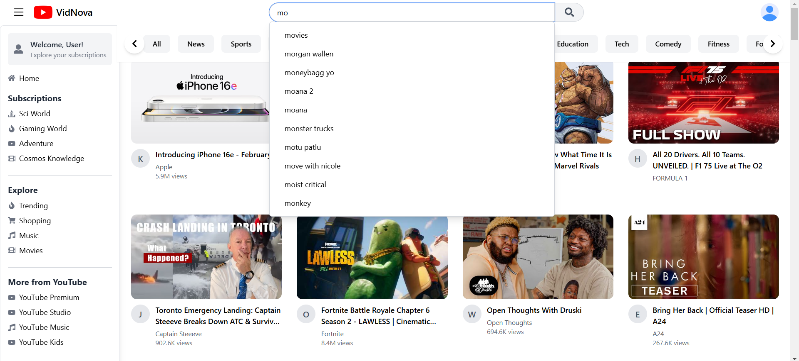

### 🔴 Live Video Cards

Highlights currently live streaming videos with a LIVE indicator badge.

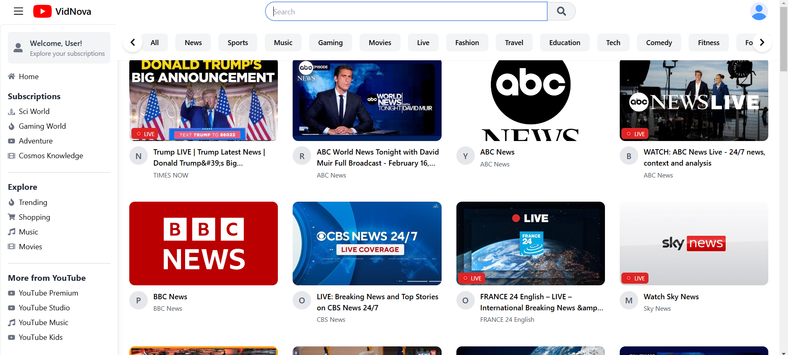

### 🗨️ Live Chat Section

Chat messages updating during a live stream.

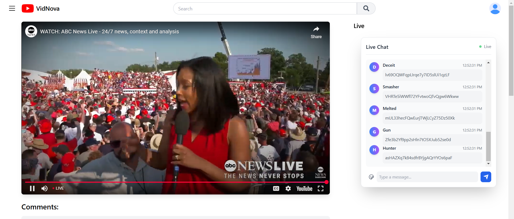

### 📱 Mobile View

Fully responsive layout optimized for mobile screens.

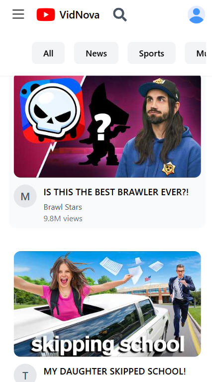
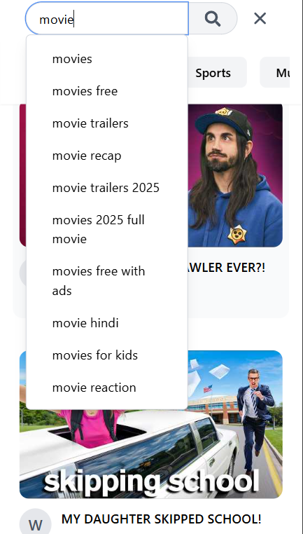
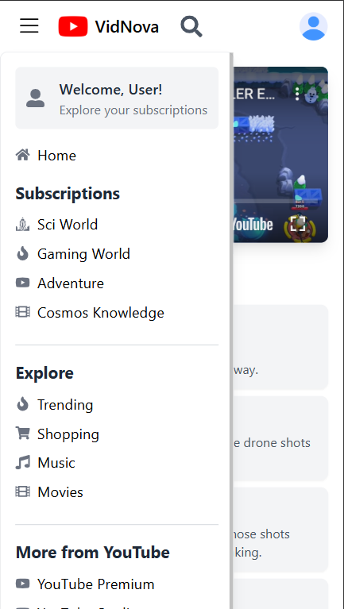
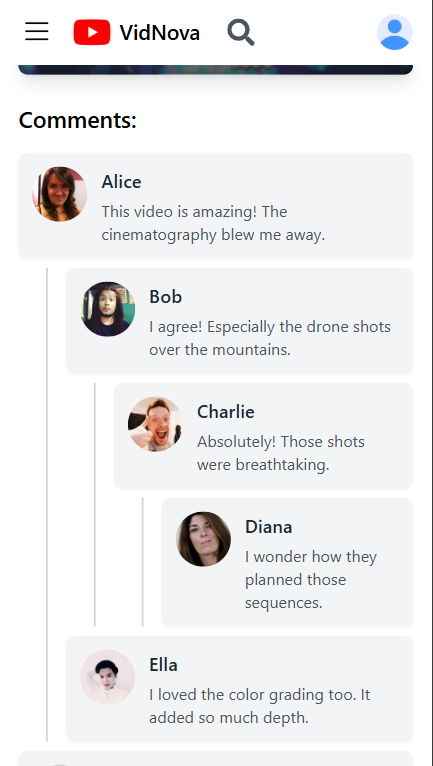
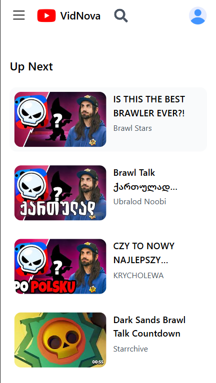
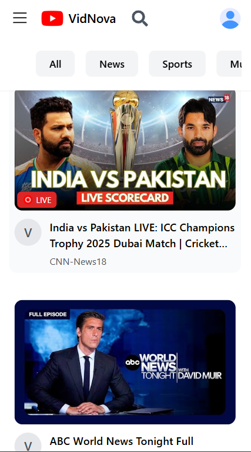
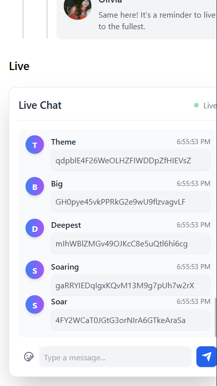
